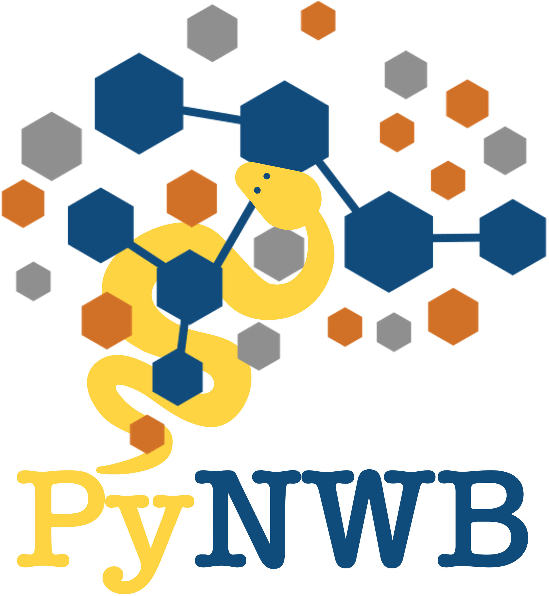

PyNWB is a Python package for working with NWB files. The PyNWB
documentation can be found at https://pynwb.readthedocs.io

Latest Release
==============

.. image:: https://badge.fury.io/py/pynwb.svg
     :target: https://badge.fury.io/py/pynwb

.. image:: https://anaconda.org/conda-forge/pynwb/badges/version.svg
     :target: https://anaconda.org/conda-forge/pynwb

Overall Health
==============

.. image:: https://github.com/NeurodataWithoutBorders/pynwb/actions/workflows/run_coverage.yml/badge.svg
    :target: https://github.com/NeurodataWithoutBorders/pynwb/actions/workflows/run_coverage.yml

.. image:: https://github.com/NeurodataWithoutBorders/pynwb/actions/workflows/run_tests.yml/badge.svg
    :target: https://github.com/NeurodataWithoutBorders/pynwb/actions/workflows/run_tests.yml

.. image:: https://github.com/NeurodataWithoutBorders/pynwb/actions/workflows/codespell.yml/badge.svg
    :target: https://github.com/NeurodataWithoutBorders/pynwb/actions/workflows/codespell.yml

.. image:: https://github.com/NeurodataWithoutBorders/pynwb/actions/workflows/ruff.yml/badge.svg
    :target: https://github.com/NeurodataWithoutBorders/pynwb/actions/workflows/ruff.yml

.. image:: https://github.com/NeurodataWithoutBorders/pynwb/actions/workflows/check_sphinx_links.yml/badge.svg
    :target: https://github.com/NeurodataWithoutBorders/pynwb/actions/workflows/check_sphinx_links.yml

.. image:: https://github.com/NeurodataWithoutBorders/pynwb/actions/workflows/run_inspector_tests.yml/badge.svg
    :target: https://github.com/NeurodataWithoutBorders/pynwb/actions/workflows/run_inspector_tests.yml

.. image:: https://github.com/NeurodataWithoutBorders/pynwb/actions/workflows/run_all_tests.yml/badge.svg
    :target: https://github.com/NeurodataWithoutBorders/pynwb/actions/workflows/run_all_tests.yml

.. image:: https://github.com/NeurodataWithoutBorders/pynwb/actions/workflows/deploy_release.yml/badge.svg
    :target: https://github.com/NeurodataWithoutBorders/pynwb/actions/workflows/deploy_release.yml

.. image:: https://readthedocs.org/projects/pynwb/badge/?version=latest
     :target: https://pynwb.readthedocs.io/en/latest/?badge=latest
     :alt: Documentation Status

.. image:: https://img.shields.io/pypi/l/pynwb.svg
     :target: https://github.com/neurodatawithoutborders/pynwb/blob/dev/license.txt
     :alt: PyPI - License

**Conda Feedstock**

.. image:: https://dev.azure.com/conda-forge/feedstock-builds/_apis/build/status/pynwb-feedstock?branchName=main
     :target: https://dev.azure.com/conda-forge/feedstock-builds/_build/latest?definitionId=5703&branchName=main
     :alt: Conda Feedstock Status

NWB Format API
==============

PyNWB is a Python package for working with NWB files. It provides a high-level API for
efficiently working with Neurodata stored in the `NWB format <https://nwb-schema.readthedocs.io>`_.

`Neurodata Without Borders (NWB) <http://www.nwb.org/>`_ is a project to develop a
unified data format for cellular-based neurophysiology data, focused on the
dynamics of groups of neurons measured under a large range of experimental
conditions.

The NWB team consists of neuroscientists and software developers
who recognize that adoption of a unified data format is an important step toward
breaking down the barriers to data sharing in neuroscience.

Installation
============

See the PyNWB documentation for details https://pynwb.readthedocs.io/en/stable/install_users.html

Code of Conduct
===============

This project and everyone participating in it is governed by our `code of conduct guidelines <.github/CODE_OF_CONDUCT.rst>`_. By participating, you are expected to uphold this code.

Contributing
============

For details on how to contribute to PyNWB see our `contribution guidelines <docs/CONTRIBUTING.rst>`_.

Citing NWB
==========

* **Manuscript:** Oliver Rübel, Andrew Tritt, Ryan Ly, Benjamin K Dichter, Satrajit Ghosh, Lawrence Niu, Pamela Baker, Ivan Soltesz, Lydia Ng, Karel Svoboda, Loren Frank, Kristofer E Bouchard. (2022). The Neurodata Without Borders ecosystem for neurophysiological data science. eLife, 11:e78362. doi: https://doi.org/10.7554/eLife.78362
* **RRID:** (PyNWB, RRID:SCR_017452)

LICENSE
=======

"pynwb" Copyright (c) 2017-2024, The Regents of the University of California, through Lawrence Berkeley National Laboratory (subject to receipt of any required approvals from the U.S. Dept. of Energy).  All rights reserved.
Redistribution and use in source and binary forms, with or without modification, are permitted provided that the following conditions are met:

(1) Redistributions of source code must retain the above copyright notice, this list of conditions and the following disclaimer.

(2) Redistributions in binary form must reproduce the above copyright notice, this list of conditions and the following disclaimer in the documentation and/or other materials provided with the distribution.

(3) Neither the name of the University of California, Lawrence Berkeley National Laboratory, U.S. Dept. of Energy nor the names of its contributors may be used to endorse or promote products derived from this software without specific prior written permission.

THIS SOFTWARE IS PROVIDED BY THE COPYRIGHT HOLDERS AND CONTRIBUTORS "AS IS" AND ANY EXPRESS OR IMPLIED WARRANTIES, INCLUDING, BUT NOT LIMITED TO, THE IMPLIED WARRANTIES OF MERCHANTABILITY AND FITNESS FOR A PARTICULAR PURPOSE ARE DISCLAIMED. IN NO EVENT SHALL THE COPYRIGHT OWNER OR CONTRIBUTORS BE LIABLE FOR ANY DIRECT, INDIRECT, INCIDENTAL, SPECIAL, EXEMPLARY, OR CONSEQUENTIAL DAMAGES (INCLUDING, BUT NOT LIMITED TO, PROCUREMENT OF SUBSTITUTE GOODS OR SERVICES; LOSS OF USE, DATA, OR PROFITS; OR BUSINESS INTERRUPTION) HOWEVER CAUSED AND ON ANY THEORY OF LIABILITY, WHETHER IN CONTRACT, STRICT LIABILITY, OR TORT (INCLUDING NEGLIGENCE OR OTHERWISE) ARISING IN ANY WAY OUT OF THE USE OF THIS SOFTWARE, EVEN IF ADVISED OF THE POSSIBILITY OF SUCH DAMAGE.

You are under no obligation whatsoever to provide any bug fixes, patches, or upgrades to the features, functionality or performance of the source code ("Enhancements") to anyone; however, if you choose to make your Enhancements available either publicly, or directly to Lawrence Berkeley National Laboratory, without imposing a separate written license agreement for such Enhancements, then you hereby grant the following license: a  non-exclusive, royalty-free perpetual license to install, use, modify, prepare derivative works, incorporate into other computer software, distribute, and sublicense such enhancements or derivative works thereof, in binary and source code form.

COPYRIGHT
=========

"pynwb" Copyright (c) 2017-2024, The Regents of the University of California, through Lawrence Berkeley National Laboratory (subject to receipt of any required approvals from the U.S. Dept. of Energy).  All rights reserved.
If you have questions about your rights to use or distribute this software, please contact Berkeley Lab's Innovation & Partnerships Office at IPO@lbl.gov.

NOTICE.  This Software was developed under funding from the U.S. Department of Energy and the U.S. Government consequently retains certain rights. As such, the U.S. Government has been granted for itself and others acting on its behalf a paid-up, nonexclusive, irrevocable, worldwide license in the Software to reproduce, distribute copies to the public, prepare derivative works, and perform publicly and display publicly, and to permit other to do so.
